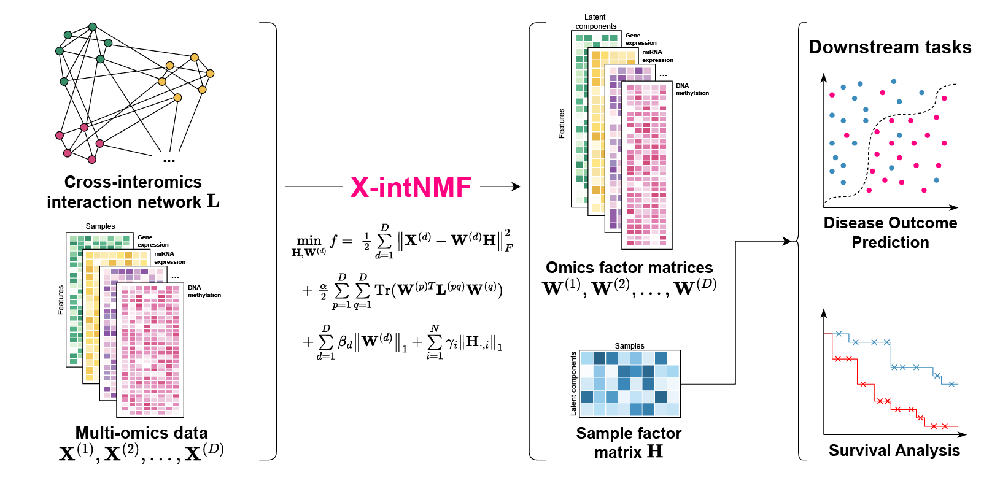

# X-intNMF

X-intNMF is the framework for multi-omics data analysis which combines integrative NMF with cross-interomics interaction network regularization for cancer subtype classification, prognosis prediction, and survival analysis.



## Installation

The required libraries are listed in the `requirements.txt` file. Users can install them using pip on user-predefined Python virtual environment or conda environment:

#### Mac/Linux
```bash
python3 -m venv /path/to/your/running/environment
source /path/to/your/running/environment/bin/activate
pip install -r requirements.txt
```

#### Windows
```powershell
python3 -m venv /path/to/your/running/environment
& /path/to/your/running/environment/Scripts/activate
pip install -r requirements.txt
```


## Sample dataset
Sample datasets are provided in the `sample_processed_data` folder. There are three subfolders:
- `BRCA_2omics` contains the breast cancer data with two omics data types: mRNA and miRNA, plus the mRNA-miRNA interaction network,
- `BRCA_3omics` contains the breast cancer data with three omics data types: mRNA, miRNA, and methylation, plus the mRNA-miRNA interaction network,
- `BRCA_micro_dataset` contains the reduced breast cancer data three omics data types: mRNA, miRNA, and methylation, plus the mRNA-miRNA interaction network, intended for quick testing.

All data files are in `*.parquet` format for read/write efficiency and DataFrame indexing. 


## Quick start guide

### Data format
To run the code successfully, the input data files must be in one of the following formats: `*.csv`, `*.xlsx`, `*.tsv`, or `*.parquet`. Among these, the Parquet format (`*.parquet`) is highly recommended due to its efficiency in reading and writing large files. 

The input data files should be structured as follows:

#### Omics data
- Each omics data is in **feature-by-sample** format, with sample names as columns and feature names as rows.
- The columns of all omics data and its order must be the same.
- Example data:
    - Omics 1
        |  Omics 1  | Sample 1 | Sample 2 | Sample 3 | Sample 4 |
        |-----------|----------|----------|----------|----------|
        |Feature 1.1| 0.1      | 0.2      | 0.3      | 0.4      |
        |Feature 1.2| 0.5      | 0.6      | 0.7      | 0.8      |
        |Feature 1.3| 0.9      | 1.0      | 1.1      | 1.2      |
        |Feature 1.4| 1.3      | 1.4      | 1.5      | 1.6      |

    - Omics 2
        |  Omics 2  | Sample 1 | Sample 2 | Sample 3 | Sample 4 |
        |-----------|----------|----------|----------|----------|
        |Feature 2.1| 0.1      | 0.5      | 0.3      | 0.4      |
        |Feature 2.2| 0.5      | 0.1      | 0.7      | 0.8      |
        |Feature 2.3| 0.9      | 0.6      | 0.7      | 0.1      |
- The framework automatically determines and detect the interaction network based on the filename. Therefore, **it is recommended to use short filenames without any whitespaces** to avoid potential errors.

#### Interaction network
- Its file name must have the following format:
```
interaction_<omics1>_<omics2>.<file_extension>
```
- Here, `<omics1>` and `<omics2>` represent the filenames of the two omics data files, and `<file_extension>` denotes the file extension (e.g., csv, xlsx, tsv, or parquet). The framework automatically detects the interaction network based on the filename.
- For instance, if the omics data files are named `omics1.csv` and `omics2.csv`, the interaction network file should be named `interaction_omics1_omics2.csv`.
- The interaction network file should be formatted in a feature-by-feature structure, where the features of the left omics (as indicated in the filename) are placed as rows and the features of the right omics as columns.
- Example interaction data between omics 1 and omics 2, with filename `interaction_omics1_omics2.csv`:
    |           | Feature 2.1 | Feature 2.2 | Feature 2.3 |
    |-----------|-------------|-------------|-------------|
    |Feature 1.1| 0           | 1           | 0           |
    |Feature 1.2| 1           | 1           | 1           |
    |Feature 1.3| 0           | 1           | 0           |
    |Feature 1.4| 0           | 0           | 1           |

#### Output data
The framework will output the factor matrices for all omics data as well as samples. For the omic factor matrices, the filenames will match with user's input file name. For example, if user's input omics files are `omics1.csv` and `omics2.csv`, the output omic factor matrices will be named `omics1_factor.csv` and `omics2_factor.csv`, respectively. The sample factor matrix will be named `sample_factor.csv`. 

Please note that the output format and directory can be customized through command-line argument `--output_format` and `--output_dir`, respectively. The output file extension can be one of the following formats: `*.csv`, `*.xlsx`, `*.tsv`, or `*.parquet`. Among these, the Parquet format (`*.parquet`) is highly recommended due to its efficiency in reading and writing large files. 


### Command
The command to run the framework is as follows, provided that user has already activated the Python virtual environment or conda environment:
```bash
python X-intNMF-run.py \
--omics_input \
/path/to/your/omic1/data \
/path/to/your/omic2/data \
... \
--interaction_input \
/path/to/your/interaction/data \
... \
<other arguments>
```


Other arguments include:
- **Output settings**
  - `--output_dir`: Specify the output directory for the results. Default is `./output`,
  - `--output_format`: Specify the output file format. Default is `parquet`. Other options are `csv`, `xlsx`, and `tsv`,
- **Parameters**
  - `--num_components`: Number of latent components to use for NMF. Default is 25,
  - `--graph_regularization`: Specify the parameter for graph regularization. Default is 1,
  - `--omics_regularization`: Specify the parameter for omics regularization. Default is 0.1,
  - `--sample_regularization`: Sample regularization parameter. Default is auto-generated by Lasso or -1,
- **Running settings**
  - `--max_iter`: Maximum number of iterations. Default is 5000,
  - `--tol`: Tolerance for stopping criteria. Default is 1e-4,
  - `--gpu`: GPU device ID. Default is -1, which means CPU. For GPU, specify the device number (e.g., `0`),
  - `--backend`: Backend for computation. Options are `numpy`, `cupy`, or `pytorch`. Default is `numpy`.
- **Logging and MLflow**
  - `--log_file`: Path to the log file. Default is `x_intnmf.log`. Use an empty string to disable logging.
  - `--mlflow_uri`: MLflow server URI for convergence logging. Format: `<mlflow_host>:<port>`. Default is an empty string (`""`), which disables MLflow logging.
  - `--mlflow_experiment_name`: MLflow experiment name. Only used if `--mlflow_uri` is set. Default is `X-intNMF`.


Sample command for running the framework with two omics data types (mRNA and miRNA) in the provided data folder and their interaction network, using GPU 0 with PyTorch backend, saving the output in Excel format, and logging the convergence to MLflow server at port 6969 and experiment name Ariel:
```bash
python X-intNMF-run.py \
--omics_input \
./sample_processed_data/BRCA_2omics/mRNA.parquet \
./sample_processed_data/BRCA_2omics/miRNA.parquet \
--interaction_input ./sample_processed_data/BRCA_2omics/interaction_mRNA_miRNA.parquet \
--output_format xlsx \
--gpu 0 \
--backend pytorch \
--mlflow_uri http://localhost:6969 \
--mlflow_experiment_name Ariel
```


## Additional information
- Users can use `python X-intNMF-run.py --help` command to show all command-line argument and its usage.
- The best parameter settings for the model are stored in the `best_params_list` folder. Users can override these parameters using command-line arguments.  
- The core model is located in the `./codes/crossOmicNMF` folder, where most functions, classes, and methods are documented with comments and docstrings. Users can fine-tune the model by modifying the code in this folder or by adjusting arguments in the `solve()` method of the main class.  
- During the research phase, X-intNMF and its baselines were run alongside the following support tools:  
    - [MLFlow](https://mlflow.org/) for experiment tracking  
    - [MinIO](https://min.io/) for data, results, and checkpoint storage  
    - [MongoDB](https://www.mongodb.com/) for storing experiment results and parameter optimization data  

    To maintain simplicity and ease of use, these tools were not included in the main model. Users interested in integrating these tools can contact the authors for further details.  
- With MLFlow, the model tracks the convergence and values of the objective function, along with its components, including the Euclidean distance between consecutive iterations of the factor matrices.


## Contact
For any concern or further assistance, please contact [tienthanh.bui@ucf.edu](mailto:tienthanh.bui@ucf.edu)


(c) 2025 bu1th4nh / UCF Computational Biology Lab. All rights reserved. 